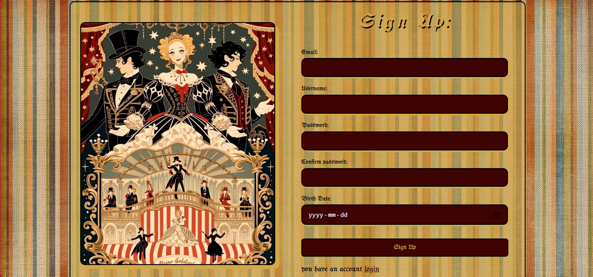

# 🎪 Circus Where Creativity Meets Code
 
> *My first PHP project and what a way to start.*
 
---
 
##  About the Project
 
**Circus** is my very first project built with PHP a full-stack web application that blends imagination with functionality, The idea? A circus-themed platform where creativity is the star of the show.
 
This wasn't just a technical exercise. It was a statement:  
**why build something ordinary when you can build something unforgettable?**
 
---
 
##  What Makes It Special
 
The circus theme wasn't chosen randomly. It represents what this project truly is:
 
-  **A mix of worlds** — creativity, time, and technology performing together under one tent
-  **Creative-first design** — every decision was made with originality in mind
---
 
## 🤝 Collaboration
 
This project was born from a beautiful creative partnership with **Tazrout Maroua**  a collaboration that proved that the best work happens when two minds push each other further.
 
Together, we didn't just write code. We built an experience.
 
---
 
## What I Built & Learned
 
This project was my **introduction to PHP** and backend web development. Through it, I learned to:
 
-  **User Management** — registration, login, sessions, and access control
-  **Database Integration** — connecting PHP to a database, running queries, managing data
-  **Product Management** — full CRUD operations for circus-themed products/items
-  **Security basics** — form validation, sanitization, and safe data handling
---
 
##  Tech Stack
 
| Layer | Technology |
|-------|-----------|
| Backend | PHP |
| Database | MySQL |
| Frontend | HTML / CSS |
 
---
 
## Getting Started
 
```bash
# Clone the repository

http://localhost/circus
```
 
---
```

---
 
## 💬 A Personal Note
 
This project marks the beginning of my backend journey. It's not perfect — first projects never are but it carries something more valuable than polish: **genuine passion and a unique idea**.
 
The circus doesn't just perform. It inspires.
 
---
 
<div align="center">
Made with ❤️ and a lot of `<?php echo "courage"; ?>`  
**× Tazrout Maroua**  thank you for this Collaboration 🎪
 
</div>
````

